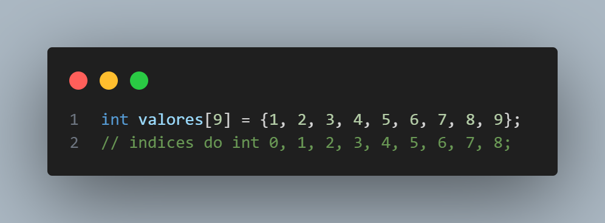

# Vetores e Matrizes

Os vetores e matrizes são conceitos essenciais para programadores, pois ajudam a organizar e manipular conjuntos de dados de forma eficiente. Eles também são amplamente utilizados em estruturas de repetição e desempenham um papel importante na análise de dados.

## Arrays (Vetores)

Um **array** é uma estrutura de dados que permite armazenar múltiplos elementos do mesmo tipo em posições consecutivas na memória através de uma variável. Essa organização facilita o acesso rápido aos elementos.

**É importante destacar que arrays podem ter mais de uma dimensão. Quando possuem apenas uma dimensão, são chamados de vetores.**

Um vetor, portanto, é uma coleção ordenada de elementos, onde cada item pode ser acessado diretamente por meio de sua posição, conhecida como índice.<br>
**Uma coisa importante sobre arrays é que o primeiro elemento sempre começa no índice zero. Por exemplo, se você tiver um array de inteiros com 9 posições, os índices vão de 0 até 8. Podendo ser citado com o nome da variável e o valor do índice (``valores[8];``)**

```c
    int valores[9] = {1, 2, 3, 4, 5, 6, 7, 8, 9};
    // indices do int 0, 1, 2, 3, 4, 5, 6, 7, 8;
```

> OBS: Nesse exemplo eu tentei alinhar os valores do indice com os valores da array correspondente. (Espero que tenha dado certo);

</img>

> Só lembrei agora que .md permite os comandos do HTML como o ````, fiquei tão feliz em saber kskskks

## Matrizes

Uma **matriz** é como um array "multidimensional". Podendo ser escrita como uma tabela, assim tendo como uma "segunda dimensão", e assim como um array simples, nós podemos utilizar índices para chamar um valor dentro da matriz, **porém será necessário utilizar dois índices dessa vez (Ainda começando pelo 0).**

```c
int tabela[3][3] = {
    {00, 01, 02}, // Linha da dezena 0
    {10, 11, 12}, // Linha da dezena 1
    {20, 21, 22} // Linha da dezena 2
};
```

> Nesse exemplo eu coloquei as coordenadas igual ao valor do resultado para ficar mais fácil de compreender, por exemplo: 

|      **Input**     |   **Output**  |
|:------------------:|:-------------:|
| tabela ``[0][0]``  |       00      |
| tabela ``[0][1]``  |       01      |
| tabela ``[0][2]``  |       02      |
| tabela ``[1][0]``  |       10      |
| tabela ``[1][1]``  |       11      |
| tabela ``[1][2]``  |       12      |
| tabela ``[2][0]``  |       20      |
| tabela ``[2][1]``  |       21      |
| tabela ``[2][2]``  |       22      |

>E como podemos ver no nosso exemplo, o <ins>`primeiro índice`</ins> da matriz representa <ins>`as linhas`</ins> e o <ins>`segundo índice`</ins> representa <ins>`as colunas`</ins>, tal qual uma coordenada mesmo.

## Importância

Importância de Arrays e Matrizes em C
Arrays e matrizes são estruturas de dados fundamentais em programação devido às suas vantagens em eficiência, organização e uso de memória.

<hr>

### >> Eficiência

<hr>

O acesso a um elemento do array é feito diretamente pelo índice, o que ocorre em **tempo constante (O(1))**.<br>
Isso significa que o tempo para acessar um elemento não aumenta com o tamanho do array.<br>
O mesmo vale para matrizes: podemos acessar qualquer posição com os índices [linha][coluna] de forma rápida.

- Exemplo de acesso direto em um array:

```c
int valores[5] = {10, 20, 30, 40, 50};
printf("%d\n" , valores[2]);  // Saída: 30`
```
> Independente do tamanho do array, acessar valores[2] leva o mesmo tempo.

<hr>

### >> Organização

<hr>

Arrays e matrizes ajudam a estruturar e organizar os dados de forma lógica.<br>
Isso torna os algoritmos mais legíveis, fáceis de manter e eficientes.<br>

- Exemplo de uso organizado de uma matriz (tabela de notas):

```c
int notas[2][3] = { {7, 8, 9}, {6, 5, 10} };
printf("Nota do aluno 2 na prova 3: %d\n", notas[1][2]);  // Saída: 10
```
> Usar índices [linha][coluna] ajuda a estruturar dados tabulares, como notas de alunos.
<hr>

### Memória Contígua

<hr>
Os elementos de um array são armazenados em blocos contíguos na memória, o que melhora o desempenho.

Isso otimiza o uso da memória cache do processador, acelerando a leitura dos dados.

O princípio da localidade espacial diz que acessar dados próximos entre si na memória é mais rápido.

- Exemplo de acesso sequencial (cache-friendly):

```c
for (int i = 0; i < 5; i++) {
    printf("%d ", valores[i]);  // Acessa os elementos de forma sequencial
}
```

> O processador carrega vários elementos próximos de uma vez, melhorando a velocidade.

<hr>

### >> Resumo

<hr>

**Eficiência:** Acesso rápido e constante aos elementos.<br>
**Organização:** Estruturação lógica dos dados.<br>
**Memória Contígua:** Melhor desempenho devido ao cache do processador.

>Arrays e matrizes são essenciais para armazenar e manipular dados de forma eficiente e organizada, tornando-se indispensáveis em programação!
