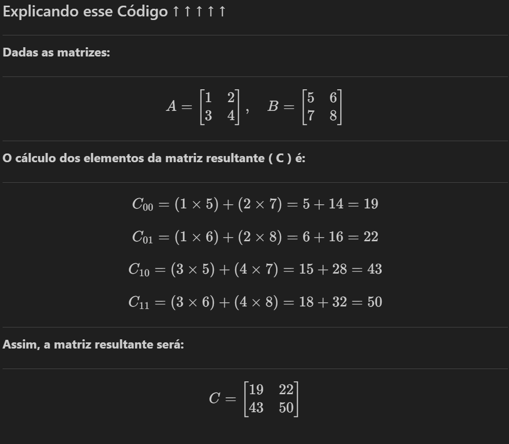

# Alguns Exemplos de Arrays e Matrizes - Parte 1

Nesses exemplos, eu vou colocar o código por completo, ou seja, haverá o `int main()` e o `#include` em todos eles. Além disso, não pretendo separar os códigos por etapas usando funções, pois sinto que assim ficará mais fácil para explicar e compreender.

# Arrays

## >> Exemplo 1 - Armazenando e Imprimindo 5 números

```c
#include <stdio.h>

int main() {
    int numeros[5]; // Cria um vetor de 5 elementos
    
    // Loop para armazenar 5 números
    for(int i = 0; i < 5; i++) { // Cria um loop que vai rodar 5 vezes e começa em zero
        printf("Digite um número: "); // Pede para o usuário digitar um número
        scanf("%d", &numeros[i]); // Armazena o número digitado no vetor
    }

    // Loop para imprimir 5 números
    for(int j = 0; j < 5; j++) { // Cria um loop que vai rodar 5 vezes e começa em zero
        printf("%d\t", numeros[j]); // Imprime o número armazenado no vetor
    }
    return 0;
}
```

> Apesar do código já estar sendo explicado, é importante notar que o loop se inicia em zero, pois esse valor inicial é essencial para conseguirmos armazenar no primeiro índice do vetor (`índice 0`). Se o loop fosse iniciado em 1, ele começaria o armazenamento a partir do segundo índice.
<hr>

## >> Exemplo 2 - Somando os Elementos de um Vetor

```c
#include <stdio.h>

int main() {
    int numeros[5] = {5,10,15,20,25}; // Cria um vetor com 5 valores já definidos
    int soma = 0; // Cria uma variável para armazenar a soma e zeramos o valor dela
    
    for (int i = 0; i < 5; i++) { // Cria um loop que vai rodar 5 vezes e começa em zero
        soma += numeros[i]; // Armazenamos o valor atual da soma junto do valor do índice i
    }
    
    printf("%d", soma); // Escrevemos na tela o resultado da soma
    return 0;
}
```

> Nesse código foi usada uma variável para armazenar o resultado da soma, e quando o loop se inicia novamente, o valor de soma vai ser o resultado da soma anterior + o novo valor do índice i.
<hr>

## >> Exemplo 3 - Encontrando o Maior Valor do Vetor

```c
#include <stdio.h>

int main() {
    int numeros[5] = {50, 55, 57, 61, 14}; // Vetor com 5 números
    int maior = numeros[0]; // Inicializa "maior" com o primeiro número do vetor
    
    for (int i = 0; i < 5; i++) { // Percorre o vetor
        if (numeros[i] > maior) { // Se o número atual for maior que "maior"
            maior = numeros[i]; // Atualiza "maior" com o número atual
        }
    }
    
    printf("O maior número é: %d", maior); // Exibe o maior número
}
```

> O código percorre um vetor de 5 números e encontra o maior valor. Ele compara cada elemento com a variável `maior`, atualizando-a sempre que encontra um número maior. No final, exibe o maior número encontrado.

# Matrizes

## >> Exemplo 1 - Preenchendo e Exibindo uma Matriz 3x3

```c
#include <stdio.h>

int main() {
    int matriz[3][3]; // Cria uma matriz 3x3

    // Preenchendo a matriz
    for (int i = 0; i < 3; i++) { // Fazemos um loop que controla as linhas
        for (int j = 0; j < 3; j++) { // Fazemos um loop que controla as colunas
            printf("Digite o valor para [%d][%d]: ", i, j); // Pedimos um valor para aplicar nas casas
            scanf("%d", &matriz[i][j]); // Armazenamos esses valores nas casas correspondentes
        }
    }

    // Exibindo a matriz
    printf("\nMatriz:\n"); // Exibimos o cabeçalho
    for (int i = 0; i < 3; i++) {  // Fazemos um loop para ler as linhas
        for (int j = 0; j < 3; j++) { // Outro para ler as colunas
            printf("%d ", matriz[i][j]); // Imprimimos os valores
        }
        printf("\n"); // Pulamos para a próxima linha quando a primeira já estiver feita
    }

    return 0;
}
```

> Nesse exemplo, usamos um loop aninhado para preencher e exibir uma matriz 3x3.

<hr>

## >> Exemplo 2 - Somando os Valores de uma Matriz 3x3

```c
#include <stdio.h>

int main() {
    int matriz[3][3] = {
        {9,9,9},
        {9,9,9},
        {9,9,9}
    }; // Criamos uma matriz 3x3 com todos os valores == 9
    int soma = 0; // Criamos uma variável para armazenar o valor da soma
    
    for(int lins = 0; lins < 3; lins++) { // Loop para ler as linhas
        for(int cols = 0; cols < 3; cols++) { // Loop para ler as colunas
           soma += matriz[lins][cols]; // Armazenamos o valor atual da soma junto do valor do índice atual
        }
    }
    
    printf("%d", soma);  // Escreve na tela o valor da soma
}
```

> Acho que consegui explicar tudo na documentação do código.

## >> Exemplo 3 - Multiplicando Matrizes 2x2

```c
#include <stdio.h>

int main() {
    // Declaração e inicialização de duas matrizes 2x2
    int A[2][2] = { 
        {1, 2}, 
        {3, 4} 
    };
    int B[2][2] = { 
        {5, 6}, 
        {7, 8} 
    };
    int C[2][2];  // Matriz que armazenará o resultado da multiplicação

    // Loop para percorrer as linhas da matriz A
    for (int i = 0; i < 2; i++) {
        // Loop para percorrer as colunas da matriz B
        for (int j = 0; j < 2; j++) {
            C[i][j] = 0;  // Inicializa a posição da matriz C com zero
            
            // Loop para realizar o cálculo da multiplicação de matrizes
            for (int k = 0; k < 2; k++) {
                C[i][j] += A[i][k] * B[k][j];
                // Multiplica elementos correspondentes e soma ao valor atual de C[i][j]
            }
        }
    }

    // Exibição da matriz resultante C
    printf("Matriz Resultante (AxB):\n");
    for (int i = 0; i < 2; i++) {
        for (int j = 0; j < 2; j++) {
            printf("%d ", C[i][j]);  // Imprime cada elemento da matriz C
        }
        printf("\n");  // Quebra de linha para formatar a saída corretamente
    }

    return 0;
}
```

### Explicando esse Código &uarr; &uarr; &uarr; &uarr; &uarr;

<hr>

**Dadas as matrizes:**
<hr>

$$
A = \begin{bmatrix} 1 & 2 \\ 3 & 4 \end{bmatrix}, \quad
B = \begin{bmatrix} 5 & 6 \\ 7 & 8 \end{bmatrix}
$$

<hr>

**O cálculo dos elementos da matriz resultante \( C \) é:**
<hr>

$$
C_{00} = (1 \times 5) + (2 \times 7) = 5 + 14 = 19
$$

$$
C_{01} = (1 \times 6) + (2 \times 8) = 6 + 16 = 22
$$

$$
C_{10} = (3 \times 5) + (4 \times 7) = 15 + 28 = 43
$$

$$
C_{11} = (3 \times 6) + (4 \times 8) = 18 + 32 = 50
$$

<hr>

**Assim, a matriz resultante será:**
<hr>

$$
C = \begin{bmatrix} 19 & 22 \\ 43 & 50 \end{bmatrix}
$$

##

> Confesso que nessa última parte eu precisei de uma ajuda da IA ksks

<hr>

Caso no seu dispositivo não esteja esteja mostrando a explicação como deveria e só tem um monte de código bizzaro, saiba que era para você estar vendo assim:

</img>
